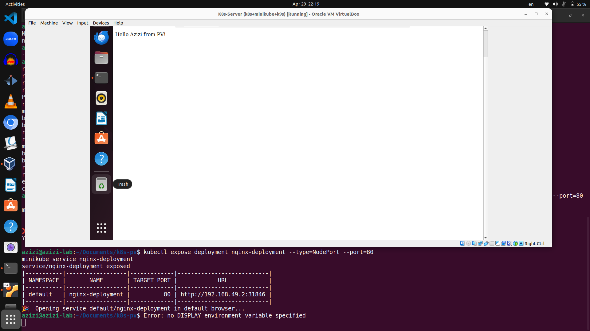

#  Kubernetes Persistent Volume (PV) Demo

This project is a beginner-friendly tutorial to demonstrate how to assign **Persistent Volumes (PVs)** and **Persistent Volume Claims (PVCs)** to a Kubernetes application (Nginx). It runs on a local Kubernetes cluster using **Minikube**.

---

## 📦 Project Structure
  ``` 
  k8s-pv-demo/ 
  ├── pv.yaml # PersistentVolume definition 
  ├── pvc.yaml # PersistentVolumeClaim definition 
  └── nginx-deployment.yaml # NGINX Deployment 
  ``` 

---

## 🎯 What You'll Learn

- What are Persistent Volumes (PV) and Persistent Volume Claims (PVC)
- How to define PV and PVC in YAML
- How to mount a PVC to a Kubernetes deployment
- How to test storage persistence using an Nginx container

---

## Prerequisites

Make sure you have the following tools installed:

- [Minikube](https://minikube.sigs.k8s.io/docs/start/)
- [kubectl](https://kubernetes.io/docs/tasks/tools/)
- [Docker (optional)](https://www.docker.com/products/docker-desktop)

---

##  Getting Started

### 1. Start Minikube

```bash
minikube start
```

## Create a Persistent Volume (PV)

```
kubectl apply -f pv.yaml
```

## Create a Persistent Volume Claim (PVC)

```
kubectl apply -f pvc.yaml
```

## Deploy Nginx with the PVC

```
kubectl apply -f nginx-deployment.yaml
```

## Check the status of your resources:
```
kubectl get pv
kubectl get pvc
kubectl get pods
```

##  Test the Volume
Open a terminal in the Nginx pod:

```
kubectl exec -it <nginx-pod-name> -- /bin/bash

```
Create a file in the mounted volume:

```
echo "Hello from Persistent Volume!" > /usr/share/nginx/html/index.html
```
Expose the Nginx service:

```
kubectl expose deployment nginx-deployment --type=NodePort --port=80
minikube service nginx-deployment

```

## You should now see the message in your browser. :)


